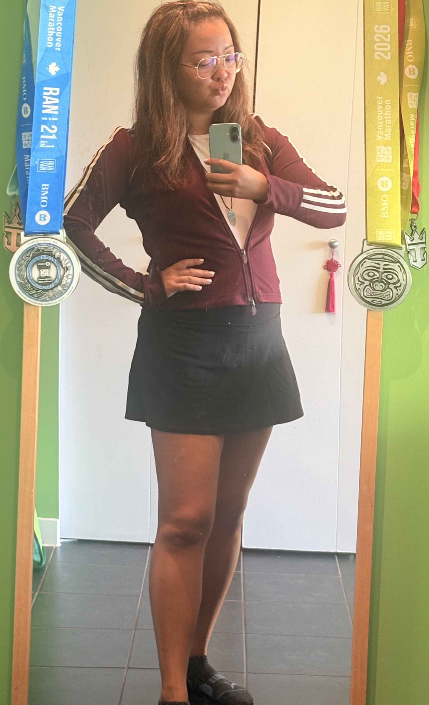

My first few weeks in the Master of Data Science program have been exciting and intense. Orientation gave me a chance to meet my classmates and learn more about how the program is structured. Once classes started, I quickly realized how fast-paced the program is and how much material we cover in a short period of time.

One thing that surprised me was how quickly we started working with different tools and programming languages. I have already been using Python, R, Git, GitHub, the terminal, and Quarto. Some of these were unfamiliar to me at the beginning, but I am becoming more comfortable with them through practice.

Now that I am a couple of weeks into the program, I feel much more settled. There is still a lot to learn, but I am starting to understand the workflow and feel more confident solving problems on my own. I am looking forward to seeing how much I improve over the rest of the program.